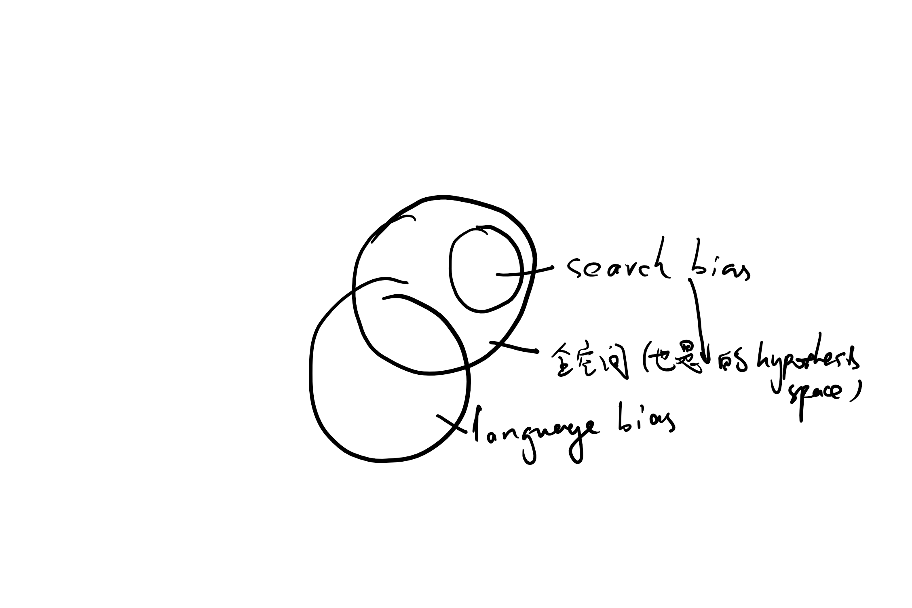

# Lecture 2 - 3/9

## TOPIC 1 (续)

### 西洋跳棋

- feature：
    1. 数量：王数量，各方棋子数量，边缘子，威胁子
    2. 关系：连线、邻接、到底线平均距离
    3. binary：谁先手

- 目标函数（局面评估）：——可操作性
    - 最后状态：赢，+100；输，-100
    - 中间状态：？开销大，引入近似（称为假设）

- 训练：如何表示experience
    - 棋局状态
    - 多项式
    - 神经网络
    - ...
    - 【问题】精确性vs数据量

- 算法：
    - 权值：初始化为1（反正不要取0）
    - 计算error
    - 后向更新
    - 注意：feature取值可能差异大，要归一化
    - 数据量大时：batch，用一批的平均值更新
    - 可能出现局部最优，可以重复很多遍，从很多random的初始权值开始

- Overview：
    1. 收集数据（experience）：外部、自己和自己下棋...——data
    2. 要学什么（features）———— features & represent
    3. 怎么描述目标函数    __|
    4. 怎么学（算法）      ——algorithm

---

## TOPIC 2: 决策树学习

### targeting problem
1. nominal data: 不好数量化
2. 离散
3. no natual similary notion

### 描述
- feature：元组

### 定义
- instance space X：实例空间
- hypothesis class H：假设空间
- training example D：训练样例，positive/negative
- target function C：目标函数<x_i, c(x_i)>
- 目标：h(x) = c(x) for all x ∈ X

### 重要算法
- CART, ID3, C4.5
- CART: classification & regression tree
- ID3: 找best根节点，直到perfectly classified——两个英文很难评判
    - best：原则：越简单越好，奥卡姆剃刀，purity 纯度
        - entropy 熵 = Σ-p*log_2(p)
        - gini impurity i(N) = 1-Σp^2（常用于搜索引擎，因为最前面的结果最重要）
        - 信息增益：Gain(S, A) = Entropy(S) - Σ(|S_v|/|S|)*Entropy(S_v)
    - 停止：1. 当前所有子集都有同样输出；2. 当前子集都有同样输入（即，可用的feeature都一样）
    -  _注意_ ，不用IG=0当成停止条件，经典例子：异或
    - 缺点：hypothesis空间本身是完备的，但ID3算法每次只选一条路且不回溯——有偏空间/局部最优，当feature>20时一般不用
    - 优点：每一步都用到了所有数据，对噪声容纳度高，比较鲁棒
    - bias：ID3中，存在search bias，但不存在language bias（因为hypothesis space是完备的）。另外 _参考_：inductive bias

    

### over-fitting 过拟合
- Decision tree很容易过拟合，导致泛化能力差
- 避免方法：
    1. stop growing 预剪枝——节省资源
        - 经验(rod of sum)：当前子集样本量小于全集的5%
        - 阈值：IG变化量小于阈值后停止
    2. 后剪枝
        - 基于错误率降低的剪枝：验证集:减掉该节点后，在验证集上性能是否提升？
        - 基于规则的剪枝——最常用：对规则排序；可能恢复不了树的形状但是无所谓

### 延伸
1. 连续数据？
2. 缺失数据？