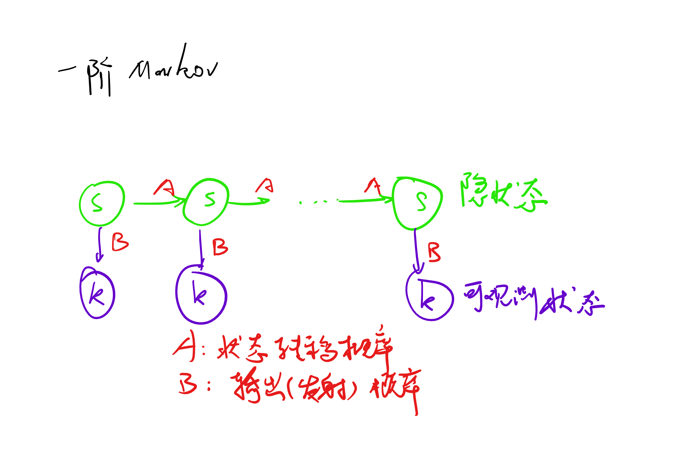

# Lecture 4 - 3/23 

## Topic 4: Markov Model

### HMM

- 不能直接观测到天气，只能观测到间接证据
- 如图所示：

- w:天气，u:带不带伞
- P(w1w2...wn|u1u2...un) = P(u1...un|w1..wn) * P(w1...wn) / P(u1...un) 贝叶斯
- **输出独立性假设**：P(w1w2...wn|u1u2...un) = ΠP(wi|ui)

### HMM的3个基本问题
- 给定HMM μ={A, B, π}，π：初始状态
- 输出（观测）序列：σ=O_1, O_2, ...
- 问题
    1. 估计问题：计算特定输出状态序列的概率
    2. 解码问题/推理inference：给定输出序列，推测最可能的隐状态序列
    3. 学习：给出了输出状态序列的集合，找一组最优的μ，使得这个概率最大——学出来参数

### 以下见PPT